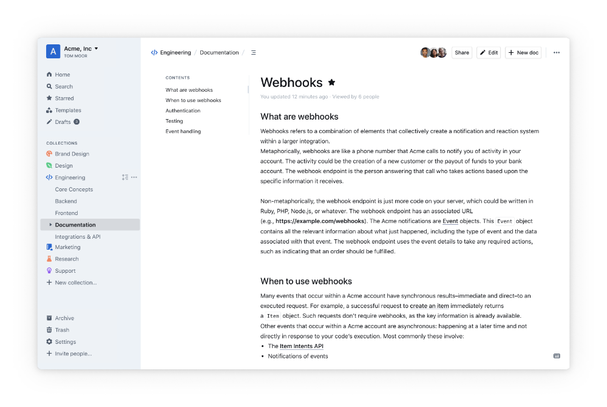

<!--
N.B.: This README was automatically generated by https://github.com/YunoHost/apps/tree/master/tools/README-generator
It shall NOT be edited by hand.
-->

# Outline for YunoHost

[](https://dash.yunohost.org/appci/app/outline)  

[](https://install-app.yunohost.org/?app=outline)

*[Lire ce readme en français.](./README_fr.md)*

> *This package allows you to install Outline quickly and simply on a YunoHost server.
If you don't have YunoHost, please consult [the guide](https://yunohost.org/#/install) to learn how to install it.*

## Overview

Outline is a wiki and knowledge base for growing teams. Beautiful, feature rich, and markdown compatible.

### Features

- Fully working installation of Outline wiki
- Including a Dex server to connect to YunoHost's LDAP userbase using an OIDC auth flow
- Using Yunohost's built-in SMTP server for notifications


**Shipped version:** 0.74.0~ynh1

**Demo:** https://app.getoutline.com/create

## Screenshots



## :red_circle: Antifeatures

- **Not totally free upstream**: The packaged app is under an overall free licence, but with clauses that restrict its use.

## Documentation and resources

* Official app website: <https://www.getoutline.com>
* Official user documentation: <https://www.getoutline.com/about>
* Official admin documentation: <https://www.getoutline.com/developers>
* Upstream app code repository: <https://github.com/outline/outline>
* YunoHost Store: <https://apps.yunohost.org/app/outline>
* Report a bug: <https://github.com/YunoHost-Apps/outline_ynh/issues>

## Developer info

Please send your pull request to the [testing branch](https://github.com/YunoHost-Apps/outline_ynh/tree/testing).

To try the testing branch, please proceed like that.

``` bash
sudo yunohost app install https://github.com/YunoHost-Apps/outline_ynh/tree/testing --debug
or
sudo yunohost app upgrade outline -u https://github.com/YunoHost-Apps/outline_ynh/tree/testing --debug
```

**More info regarding app packaging:** <https://yunohost.org/packaging_apps>
